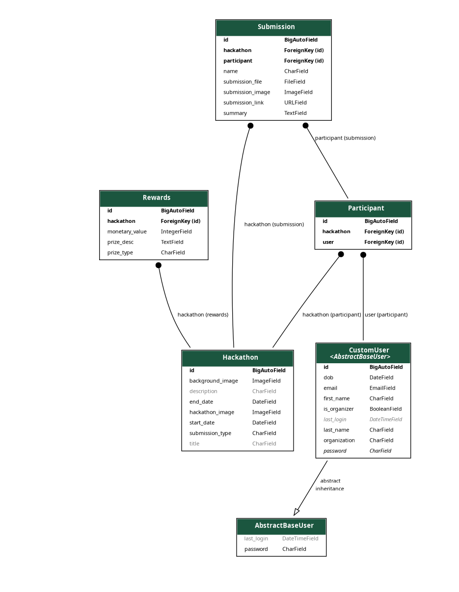

# Hackathon Backend
This mini project serves the functionality to organise hackathons in a smooth manner. The features added here for now are:
  - the ability to host hackathons by Organizers 
  - ability to participate in hackathons
  - List all hackathons
  - Submit To Hackathon
  - View Submissions
  - View Enrolled Hackathons


## ER  Diagram




## Project Setup
To run this project kindly follow these steps:

(It is preferred to prepare a virtual environment if you wish so for the project)

```python -m venv venv```
```pip install -r requirements.txt```
  - Also ensure that you have postgresql locally setup on your system.
  - Also create a database named aiplanet in the same.
  - The version of PostgreSQL I have used for the project is 15.2.
  - Run the migrations
```python manage.py makemigrations && python manage.py migrate```
Finally run the server as:
```python manage.py runserver```

## Postman Collection
<a href="https://github.com/destrex271/Hackathon-Hosting/blob/main/AIPlanet.postman_collection.json">Click Here</a>
